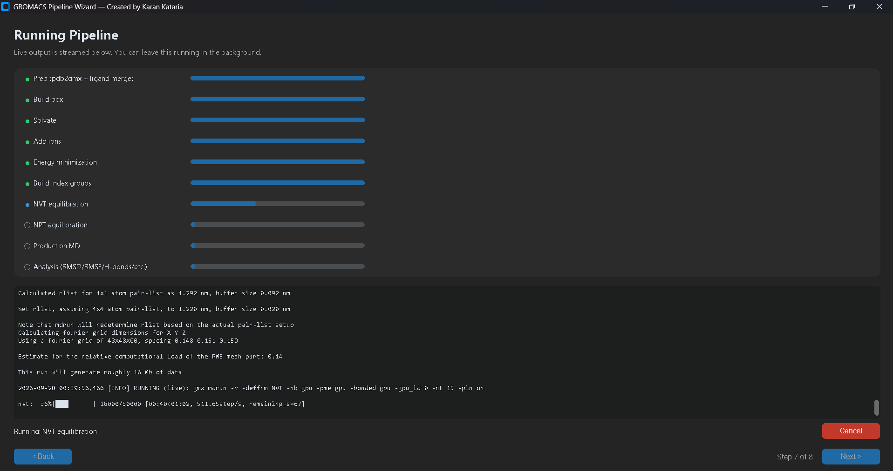
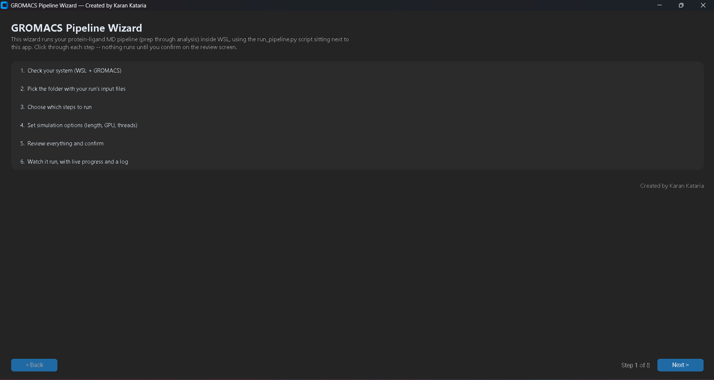
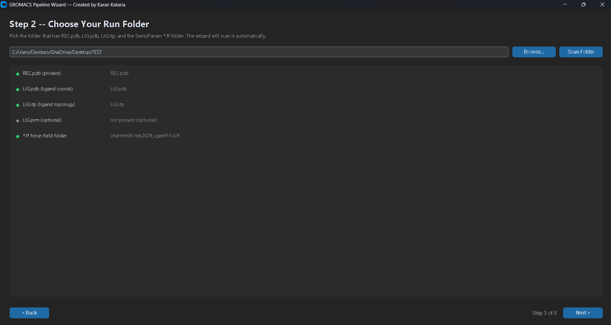

# GROMACS Wizard

A Windows desktop application that automates the full CHARMM36/CGenFF
protein-ligand molecular dynamics workflow in GROMACS — from system prep
through production MD and analysis — behind a simple step-by-step wizard.
No command line, no scripting, no manual GROMACS commands required.



## Screenshots

<table>
<tr>
<td></td>
<td></td>
<td></td>
</tr>
<tr>
<td align="center"><sub>Welcome</sub></td>
<td align="center"><sub>Input detection</sub></td>
<td align="center"><sub>Live run progress</sub></td>
</tr>
</table>

## What this does

GROMACS Wizard walks you through:

1. Checking your system (WSL, GROMACS, Python) is ready
2. Picking the folder with your protein/ligand input files
3. Choosing to run the full pipeline or a single step
4. Setting simulation options (run length, GPU, thread count)
5. Reviewing everything before it runs
6. Watching live progress, with per-step progress bars and a scrolling log

Behind the scenes it runs a checkpointed Python pipeline (`run_pipeline.py`)
inside WSL, driving `gmx` through prep → box → solvate → ions → EM → index →
NVT → NPT → MD → analysis, and produces a five-panel publication-ready plot
(RMSD, RMSF, Rg, H-bonds, SASA) at the end.

## Download

**[Download the latest installer from the Releases page →](../../releases/latest)**

Download `GromacsWizard_Setup_x.x.x.exe`, run it, and launch GROMACS Wizard
from your Desktop or Start Menu. The installer bundles the CHARMM36/CGenFF
force field, the pipeline script, and all required `.mdp` templates — no
separate downloads needed for those.

## Requirements

- Windows 10/11
- WSL2 with an Ubuntu distribution (the app will detect this and guide you
  through installing it if it's missing)
- GROMACS installed inside WSL (CPU or GPU/CUDA build)
- An NVIDIA GPU is recommended for production MD runs, but the pipeline also
  works on CPU-only systems

## Per-project input files

For each simulation you run, prepare a folder containing:

- `REC.pdb` — your DockPrep'd protein structure
- `LIG.pdb` — ligand coordinates, same frame as `REC.pdb`
- `LIG.itp` — ligand topology (from SwissParam)
- `LIG.prm` — optional, if SwissParam generated one

The base force field is bundled with the app — you don't need to copy it
into every project folder.

## Building from source

See [`installer/GromacsWizard_Setup.iss`](installer/GromacsWizard_Setup.iss)
for the full installer definition. Summary:

```
pip install nuitka customtkinter
cd src
python -m nuitka --onefile --standalone --windows-console-mode=disable ^
    --enable-plugin=tk-inter --windows-icon-from-ico=GromacsWizard.ico ^
    --output-filename=GromacsWizard.exe gromacs_gui_test.py
```

Then compile `installer/GromacsWizard_Setup.iss` with
[Inno Setup](https://jrsoftware.org/isinfo.php).

## Credits

- CHARMM36/CGenFF force field files: MacKerell Lab / SwissParam
- Built on [GROMACS](https://www.gromacs.org/)

## License

MIT — see [LICENSE](LICENSE).
